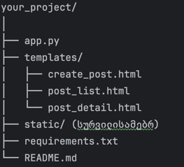

# 📝 Flask დავალება: პოსტების აპლიკაცია

### 🎯 დავალების მიზანი:

ამ დავალების მიზანია Flask-ის გამოყენებით ააწყოთ CRUD ტიპის ვებ-აპლიკაცია, 
რომელიც უზრუნველყოფს პოსტების (სათაური და აღწერა) შექმნას, ჩამონათვალს და დეტალურ ჩვენებას. 
გამოიყენეთ შემდეგი ტექნოლოგიები:

- 📦 Flask
- 💾 SQLite (მონაცემთა ბაზა)
- 🧾 WTForms (ფორმების დასამუშავებლად)

---

### 📋 ფუნქციონალი:

✅ პოსტის შექმნა  
✅ პოსტების სია (ჩამონათვალი)  
✅ პოსტის დეტალური ნახვა

---

### 🛠️ ტექნოლოგიური მოთხოვნები:

- Python
- Flask
- SQLite
- Flask-WTF (WTForms ინტეგრაციისთვის)

---

### 📁 პროექტის სტრუქტურა (მაგალითი):



### ⚙️ რეპოზიტორიის დაფორკვა:


რეპოზიტორიის სახელში გასწვრის  დაინახავთ Fork ღილაკს. დააჭირეთ მას, 
რათა შექმნათ თქვენი საკუთარი ვერსია რეპოზიტორიისა. როდესაც თქვენი ვერსია შექმნილია,
თქვენ შეგიძლიათ დააკლონოთ იგი თქვენს კომპიუტერში. ამისათვის,
თქვენ უნდა გახსნათ თქვენი ტერმინალი და შეასრულოთ შემდეგი ბრძანება:

```bash

git clone <repository-url>
```
ამის შემდეგ, თქვენ უნდა გადახვიდეთ თქვენს პროექტის დირექტორიაში:

```bash

cd <repository-name>
```
ამის შემდეგ, თქვენ უნდა დააინსტალიროთ ყველა საჭირო პაკეტი:

### ⚙️ ინსტალაცია და გაშვება (ლოკალურად):

ვირტუალური გარემოს შექმნა:

```bash

python -m venv venv
source venv/bin/activate   # Mac/Linux
venv\Scripts\activate      # Windows
pip install  ******
```

ცვლილებების დაკომიტება:

```bash

git add .
git commit -m "your message"
```
გადაწერა რეპოზიტორში:

```bash

git push origin main
```

# **საბოლოოდ დამილინკეთ თქვენი GitHub დაფორკილი რეპოზიტორია**

